# 🚀 High Performance Betting System (MVP)

> **Case Study de Engenharia de Software:** Arquitetura de microsserviços orientada a eventos capaz de ingerir e processar **+1.2 milhão de apostas por minuto** em hardware local.

## 📖 Visão Geral do Projeto
Este projeto simula um ecossistema de alta volumetria para processamento de apostas (cenário Mega da Virada). O foco foi criar uma arquitetura distribuída, desacoplada e escalável, utilizando as melhores práticas de **Spring Cloud** e **Java Moderno (Virtual Threads)**.

O sistema realiza um Benchmark Arquitetural comparando ingestão Síncrona (Redis) vs. Assíncrona (Kafka), suportado por uma infraestrutura de configuração centralizada.

## 🧩 Estrutura do Ecossistema (Módulos)
O projeto foi modularizado para garantir reutilização de código e gestão centralizada:

| Módulo | Responsabilidade |
| :--- | :--- |
| **mega-config-server** | **Spring Cloud Config Server**. Centraliza todos os `application.yml` (Kafka, Redis, Datasource) em um único ponto, servindo configurações dinamicamente para os microsserviços. |
| **mega-common** | **Shared Library**. Contém os DTOs (`BetRequest`), Entidades JPA e utilitários compartilhados entre API e Worker, garantindo contrato único e evitando duplicação de código. |
| **mega-api** | **Producer / Gateway**. Recebe as requisições HTTP, valida os dados e despacha para o Broker (Kafka/Redis) usando **Virtual Threads**. |
| **mega-worker** | **Consumer / Processor**. Escuta os Brokers, realiza processamento em lote (Batch) e persiste os dados no PostgreSQL. |

## 🏗️ Arquitetura da Solução
A solução utiliza o padrão Microservices com configuração externalizada.

```mermaid
flowchart LR
    %% Estilos (High Contrast para Dark/Light Mode)
    classDef service fill:#326ce5,stroke:#fff,stroke-width:2px,color:#fff;
    classDef infra fill:#f08c00,stroke:#fff,stroke-width:2px,color:#fff;
    classDef db fill:#2f9e44,stroke:#fff,stroke-width:2px,color:#fff;
    classDef lib fill:#e03131,stroke:#fff,stroke-width:2px,color:#fff;
    classDef client fill:#555,stroke:#fff,stroke-width:2px,color:#fff;

    %% Nós Principais
    Client(Load Test / JMeter):::client
    API[mega-api]:::service
    Worker[mega-worker]:::service
    
    %% Banco de Dados e Brokers
    Redis[(Redis)]:::db
    Kafka[(Kafka)]:::db
    Postgres[(PostgreSQL)]:::db

    %% Infra e Libs (Auxiliares)
    Config[mega-config-server]:::infra
    Common((mega-common)):::lib

    %% --- FLUXO PRINCIPAL ---
    Client -- "HTTP POST (20k RPS)" --> API
    
    %% Estratégias
    API -- "Strategy A" --> Redis
    API -- "Strategy B" --> Kafka
    
    %% Consumo
    Redis --> Worker
    Kafka --> Worker
    
    %% Persistência
    Worker -- "Batch Insert" --> Postgres

    %% --- DEPENDÊNCIAS (Linhas Pontilhadas) ---
    Config -.-> API
    Config -.-> Worker
    
    Common -.-> API
    Common -.-> Worker
```



## 🛠️ Tech Stack & Otimizações
* **Java 25 (Virtual Threads)**: Utilizado no `mega-api` para suportar milhares de conexões simultâneas sem thread exhaustion.
* **Spring Cloud Config**: Gestão de configuração externalizada (Git/Native).
* **Maven Multi-Module**: Gestão de dependências onde `mega-api` e `mega-worker` dependem do `mega-common`.
* **Apache Kafka & Redis**: Brokers de mensagem intercambiáveis via Strategy Pattern.
* **PostgreSQL**: Otimizado para Bulk Inserts.

## ⚔️ Resultados do Benchmark
Testes realizados em ambiente local (Ryzen 5900X, 128GB RAM) com 500 Virtual Threads simultâneas por 5 minutos.

| Métrica | Estratégia Redis | Estratégia Kafka | Vencedor |
| :--- | :--- | :--- | :--- |
| **RPS Médio (Ingestão)** | ~13.300 req/s | ~19.880 req/s | 🏆 Kafka (+49%) |
| **Latência de Resposta** | 2-5 ms | 422 µs (0.4ms) | 🏆 Kafka |
| **Estabilidade** | 100% Sucesso | 100% Sucesso | 🤝 Empate |

*(Estabilidade térmica da JVM mantendo ~20k RPS constantes)*

## 🚀 Como Executar o Projeto

### Pré-requisitos
* Java 21+ instalado.
* Docker & Docker Compose.
* Maven.

### Passo a Passo de Inicialização

#### 1. Subir a Infraestrutura (Docker):
```bash
docker-compose up -d
```
Aguarde o Kafka e o Postgres estarem saudáveis.

#### 2. Compilar e Instalar o mega-common:
Como é uma dependência local, precisa ser instalada primeiro.
```bash
cd mega-common
mvn clean install
```

#### 3. Iniciar o mega-config-server (CRÍTICO):
Este serviço deve subir antes dos outros para fornecer as configurações.
```bash
cd ../mega-config-server
mvn spring-boot:run
```

#### 4. Iniciar os Microsserviços:
Em terminais separados:

```bash
# Terminal A
cd ../mega-api
mvn spring-boot:run

# Terminal B
cd ../mega-worker
mvn spring-boot:run
```

#### 5. Executar Teste de Carga:
Execute a classe `LoadTest.java` ou a `LoadTest5Min.java` (presente no pacote de testes) para iniciar o disparo de apostas.

## 👨‍💻 Autor
**Leandro Coelho**
Engenheiro de Software
